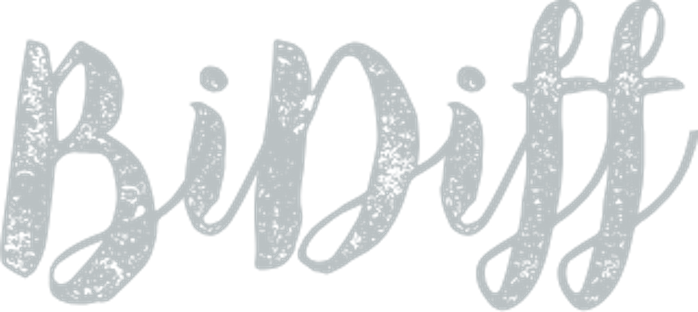
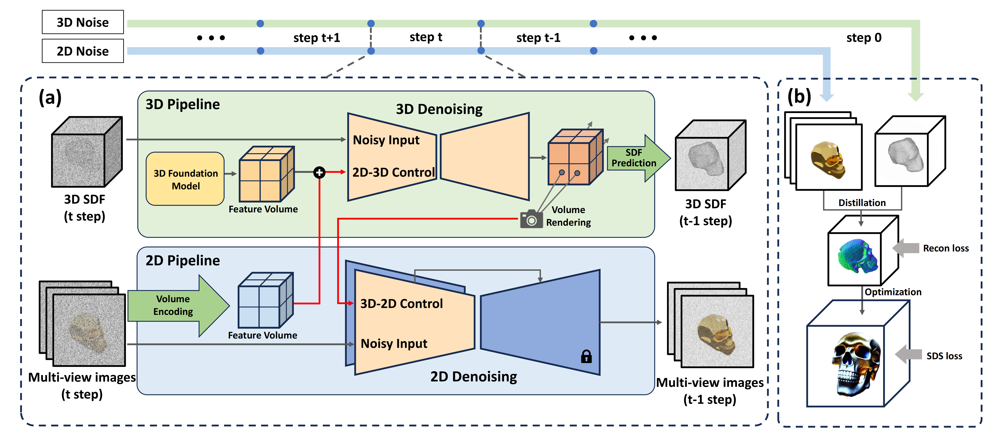

<p align="center" width="100%">

</p>


<div align="center">
    <a href='https://dinglihe.github.io/' target='_blank'>Lihe Ding<sup>1,4*</sup></a>&emsp;
    <a href='https://scholar.google.com/citations?user=Pee4FRsAAAAJ&hl=en' target='_blank'>Shaocong Dong<sup>2*</sup></a>&emsp;
    <a>Zhanpeng Huang<sup>3</sup></a>&emsp;
    <a>Zibin Wang<sup>3,†</sup></a>&emsp;
    </br>
    <a href='https://scholar.google.com/citations?user=KuYlJCIAAAAJ&hl=en' target='_blank'>Yiyuan Zhang<sup>1</sup></a>&emsp;
    <a href='https://kxgong.github.io/' target='_blank'>Kaixiong Gong<sup>1</sup></a>&emsp;
    <a href='https://www.danxurgb.net/'> Dan Xu<sup>2</sup></a>&emsp;
    <a href='https://tianfan.info/'> Tianfan Xue<sup>1</sup></a>
</div>
<div>

<div align="center">
    <sup>1</sup>
    <a> The Chinese University of Hong Kong</a>&emsp;
    </br>
    <sup>2</sup> <a> The Hong Kong University of Science and Technology </a>
    </br>
    <sup>3</sup> <a> SenseTime </a>
    <sup>4</sup> <a> Shanghai AI Laboratory </a></br>
    <sup>*</sup> Equal Contribution&emsp;
    <sup>†</sup> Corresponding Author&emsp;
</div>

-----------------

### Text-to-3D Generation with Bidirectional Diffusion using both 2D and 3D priors

[](https://arxiv.org/abs/2312.04963)
[](https://bidiff.github.io/)
<a href="https://www.youtube.com/watch?v=3AHDbJlGKwY">

</a>

*We are trying our best to clean up the code, please kindly star and watch if you're interested.*


### 1. High-quality 3D Object Generation
Click the GIF to access the high-resolution video.

<table class="center">
  <td><p align="center" width="100%">
              <!-- <video style="width: 100%;" poster="" id="shoes-video" autoplay muted loop playsinline height="100%">
                <source src="assets/case0.mp4" type="video/mp4">
              </video> -->
              <image src="assets/case0.gif" poster="" style="width: 100%;" auto-rotate shadow-intensity="1" camera-controls touch-action="pan-y"></image>
            </p></td>
  <td><p align="center" width="100%">
              <!-- <video style="width: 100%;" poster="" id="shoes-video" autoplay muted loop playsinline height="100%">
                <source src="assets/case1.mp4" type="video/mp4">
              </video> -->
            <image src="assets/case1.gif" poster="" style="width: 100%;" auto-rotate shadow-intensity="1" camera-controls touch-action="pan-y"></image>
            </p></td>
  <tr>
  <td style="text-align:center;" width="320">"An eagle head."</td>
  <td style="text-align:center;" width="320">"A GUNDAM robot."</td>
  <tr>
</table >

<table class="center">
  <td><p align="center" width="100%">
              <!-- <video style="width: 100%;" poster="" id="shoes-video" autoplay muted loop playsinline height="100%">
                <source src="assets/case2.mp4" type="video/mp4">
              </video> -->
              <image src="assets/case2.gif" poster="" style="width: 100%;" auto-rotate shadow-intensity="1" camera-controls touch-action="pan-y"></image>
            </p></td>
  <td><p align="center" width="100%">
              <!-- <video style="width: 100%;" poster="" id="shoes-video" autoplay muted loop playsinline height="100%">
                <source src="assets/case3.mp4" type="video/mp4">
              </video> -->
              <image src="assets/case3.gif" poster="" style="width: 100%;" auto-rotate shadow-intensity="1" camera-controls touch-action="pan-y"></image>
            </p></td>
  <tr>
  <td style="text-align:center;" width="320">"A Nike sport shoes."</td>
  <td style="text-align:center;" width="320">"A house in Van Gogh style."</td>
  <tr>
</table >

### 2. Meshes with Authentic Textures
Click the GIF to access the high-resolution video.

<table class="center">
  <td><div class="has-text-centered" style="width: 100%;">
              <image src="assets/bear.png" poster="" style="width: 100%;" auto-rotate shadow-intensity="1" camera-controls touch-action="pan-y"></image>
    </td>
  <td><div class="has-text-centered" style="width: 100%;">
              <image src="assets/fruit.png" poster="" style="width: 100%;" auto-rotate shadow-intensity="1" camera-controls touch-action="pan-y"></image>
    </td>
    <td><div class="has-text-centered" style="width: 100%;">
                <image src="assets/cow.png" poster="" style="width: 100%;" auto-rotate shadow-intensity="1" camera-controls touch-action="pan-y"></image>
    </td>
  <tr>
  <td style="text-align:center;" width="220">"Bear."</td>
  <td style="text-align:center;" width="220">"Fruit."</td>
  <td style="text-align:center;" width="220">"Cow."</td>
  <tr>
</table >

### 3. Biredtional Diffusion (BiDiff) Framework 

Most 3D generation research focuses on up-projecting 2D
foundation models into the 3D space, either by minimizing
2D Score Distillation Sampling (SDS) loss or fine-tuning
on multi-view datasets. Without explicit 3D priors, these
methods often lead to geometric anomalies and multi-view inconsistency. Recently, researchers have attempted to improve the genuineness of 3D objects by directly training on
3D datasets, albeit at the cost of low-quality texture generation due to the limited texture diversity in 3D datasets.
To harness the advantages of both approaches, we propose
Bidirectional Diffusion (BiDiff), a unified framework that
**incorporates both a 3D and a 2D diffusion process, to preserve both 3D fidelity and 2D texture richness, respectively**.
Moreover, as a simple combination may yield inconsistent
generation results, we further bridge them with novel bidirectional guidance. In addition, our method can be used
as an initialization of optimization-based models to further
improve the quality of 3D model and efficiency of optimization, reducing the process from 3.4 hours to 20 minutes.
Experimental results have shown that our model achieves
high-quality, diverse, and scalable 3D generation

<p align="center" width="100%">

</p>


The BiDiff framework operates as follows: (a) At each step of diffusion, we render the 3D diffusion's intermediate outputs into 2D images, which then guide the denoising of the 2D diffusion model. Simultaneously, the intermediate multi-view outputs from the 2D diffusion are re-projected to assist the denoising of the 3D diffusion model. Red arrows show the bidirectional guidance, which ensures that both diffusion processes evolve coherently. (b) We use the outcomes of the 2D-3D diffusion as a strong initialization for optimization methods, allowing for further refinement with fewer optimization steps.

### 4. Quantities of Results.

<p align="center" width="100%">
      <!-- <video muted autoplay loop>
        <source src="assets/more.mp4" type="video/mp4">
      </video> -->
      <image src="assets/more.gif" poster="" style="width: 100%;" auto-rotate shadow-intensity="1" camera-controls touch-action="pan-y"></image>
</p>    


## Citation
If the paper and the code are helpful for your research, please kindly cite:
```
@misc{ding2023textto3d,
      title={Text-to-3D Generation with Bidirectional Diffusion using both 2D and 3D priors}, 
      author={Lihe Ding and Shaocong Dong and Zhanpeng Huang and Zibin Wang and Yiyuan Zhang and Kaixiong Gong and Dan Xu and Tianfan Xue},
      year={2023},
      eprint={2312.04963},
      archivePrefix={arXiv},
      primaryClass={cs.CV}
}
```
